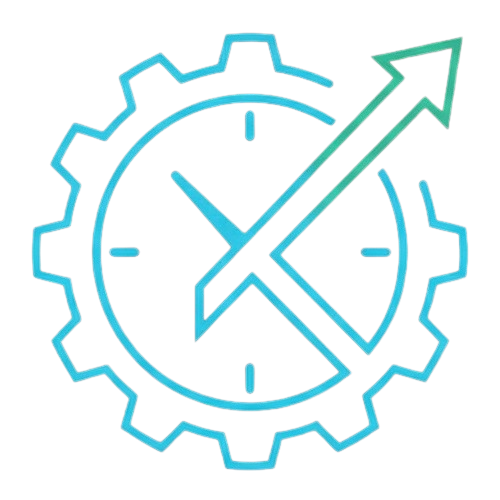

<p align="center">
  
</p>

# Kairos Tracker

> A science-backed productivity tracker built with Tauri + Claude AI that learns your energy patterns.


---

## Screenshots

<!-- Add screenshots here once the app is running. Suggested shots:
     1. Main tracker view with active timer
     2. History view with heatmap + energy curve
     3. AI digest panel
     4. ClassifyOverlay / passive capture in action
     5. Focus Lock fullscreen timer
     Replace this comment block with:
     
     
-->

> Screenshots coming soon. Download the [latest release](../../releases/latest) to try it.

---

## Why this exists

Most productivity tools count hours. This one **understands them**.

After 30 days of data, Kairos Tracker identifies your personal peak and valley hours, detects when you enter a flow state, computes your Deep Work Score, tracks your Focus Debt, and generates a Claude AI-powered weekly digest — all without your data ever leaving your machine. Supports both Claude API and local Ollama as AI backends.

---

## Features

### Core Tracking
- **Multi-category timer** — track Work, Study, Exercise, or any custom category
- **One active timer** — switching categories pauses the previous one automatically
- **Session history** — every session stored with start/end timestamps and optional context tag
- **Manual time entry** — log past sessions via a simple form with category and duration picker
- **NLP time entry** — log past sessions in natural language ("worked 3h on deep work yesterday morning")

### Passive Capture
- **Background window tracking** — Rust background thread polls the active window every 5 seconds
- **Auto-start timer** — when a classified app gains focus, the timer starts automatically with no user action needed
- **Smart classify overlay** — unknown apps are identified by name and icon; assign them to a category once and the rule is remembered forever
- **Workspace classification** — VS Code workspace folders are tracked and classified independently of the process
- **Browser domain tracking** — companion browser extension reports the active tab domain; domain rules map sites to categories
- **VS Code extension** — reports workspace and open file to enrich classification and show the timer in the status bar
- **Correction learning** — after 3 manual overrides of the same app+context, a permanent rule is promoted automatically
- **Tracking Accuracy Score** — weekly composite score measuring auto-classification quality, session stability, and coverage
- **Passive tracking indicator** — subtle status bar shows what the tracker is currently watching
- **Idle detection** — timer pauses automatically after 5 minutes of keyboard/mouse inactivity

### Science-Backed Focus
- **Focus Guard** — mandatory break system based on ultradian rhythm research (Pomodoro / 52-17 / 90-20 / Custom)
- **Strict mode** — no skips, no delays — for users who want real commitment
- **Focus Lock** — fullscreen circular timer with flow state pulse animation
- **Auto-pause** — detects inactivity and pauses the timer automatically
- **Focus Replay** — after a session ends, replay the timeline of apps used during it

### Insights & Intelligence
- **Energy score banner** — tells you in real time if you're in a peak or valley hour based on your last 30 days
- **Inline insights** — streak, peak hour, and flow count visible directly on each category
- **GitHub-style heatmap** — 13 weeks of activity with optional GitHub commit overlay
- **Flow state detection** — sessions ≥ 45 min automatically flagged as flow sessions
- **Deep Work Score (DWS 0–100)** — composite score measuring cognitive session quality
- **Context Switching Score** — tracks app switches per hour (🟢 focused / 🟡 moderate / 🔴 fragmented)
- **Interrupt Cost Widget** — estimates the time cost of each interruption based on your DRT data
- **Focus Debt** — accumulates when you skip breaks or work late; credits flow sessions and rest
- **Focus Recommendations** — actionable, data-driven coaching from your own patterns
- **Adaptive Cycles** — learns your natural focus rhythm from actual session data
- **Distraction Recovery Time** — measures how long each distraction costs you
- **Weekly AI Digest** — Claude API or local Ollama summarises your week in natural language
- **Productivity Wrapped** — monthly reveal in the style of Spotify Wrapped

### Organization
- **Daily Intentions** — morning brief + evening review with mood score
- **Minimum Viable Day** — define 1–3 must-complete goals; chip them off inline in the tracker
- **Context tags** — label sessions as deep work / meeting / admin / learning / blocked
- **Undo stack** — every timer action is undoable for 30 seconds via a toast notification
- **Category colors** — 6 color swatches per category
- **Weekly goals** — with progress bars and smart suggestions based on your 4-week average
- **Shareable stat card** — generate and copy a weekly summary image to clipboard
- **Calendar import** — import ICS/iCal files; detected focus blocks count toward your history

### Ecosystem
- **Export** — CSV, JSON, Markdown (Notion/Obsidian-ready), and standalone HTML weekly report
- **Import** — Toggl Track CSV history and ICS calendar files
- **Backup / Restore** — full database backup to any folder
- **OneDrive / Dropbox sync** — multi-device without a server
- **System tray** — live timer in the tray, control without opening the window
- **Global shortcuts** — Ctrl+Shift+T to toggle, Ctrl+K for command palette
- **Native notifications** — goal reached, daily reminder, long-session alert
- **CLI companion** — `npx @kairos-tracker/cli start work` from any terminal
- **VS Code extension** — timer in the status bar, start/stop without leaving the editor
- **Browser extension** — reports active tab domain for automatic site-to-category classification
- **pt-BR / English** — full i18n support

---

## Tech Stack

| Layer | Choice | Why |
|-------|--------|-----|
| Desktop shell | **Tauri 2** | 10× smaller binary than Electron, native Rust performance |
| UI | **React 18 + TypeScript** | Component model, strong typing |
| Styling | **Tailwind CSS** | Utility-first, no runtime overhead |
| State | **Zustand** | Minimal global store, no boilerplate |
| Persistence | **SQLite via tauri-plugin-sql** | Local-first, offline-always |
| Tests | **Vitest + Testing Library** | Fast, ESM-native, no Jest config overhead |
| AI | **Claude API + Ollama support** | Weekly digest + NLP time entry; Ollama enables 100% offline AI |

---

## Architecture

```
src/
├── domain/              # Pure business logic — no React, no Tauri
│   ├── timer.ts                  category + session model, streak computation
│   ├── history.ts                heatmap, energy pattern, flow detection, exports
│   ├── focusGuard.ts             break scheduling, compliance metrics
│   ├── intentions.ts             daily planning model
│   ├── digest.ts                 Claude API integration (digest + NLP parsing)
│   ├── passiveCapture.ts         rule engine, block aggregation, TAS, distraction detection
│   ├── classifier.ts             heuristic scoring, workspace extraction, domain rules
│   ├── contextSwitching.ts       app-switch rate + focus status classification
│   ├── deepWorkScore.ts          DWS 0–100 composite metric
│   ├── focusDebt.ts              cognitive debt accumulation model
│   ├── adaptiveCycles.ts         natural cycle inference from real session data
│   ├── distractionRecovery.ts    DRT — time lost per interruption source
│   ├── focusRecommendations.ts   heuristic coaching engine
│   ├── calendarParser.ts         ICS/iCal import — extract focus blocks
│   ├── minimumViableDay.ts       MVD goal model
│   └── sessionNaming.ts          quick tag suggestions from session patterns
│
├── services/            # External integrations (no UI, no Tauri)
│   ├── llm.ts                    unified LLM backend (Claude API + Ollama)
│   └── contextClassifier.ts      ML-style context scoring with time-of-day prior
│
├── store/               # Zustand global state
│   └── useTimerStore.ts
│
├── hooks/               # Side-effects and Tauri bridges
│   ├── useInitStore.ts           load from SQLite on startup
│   ├── usePassiveCapture.ts      Tauri event bridge, scoring, rule management
│   ├── useSettingsLoader.ts      load settings from storage into component state
│   ├── useDailyState.ts          daily intentions + MVD persistence
│   ├── useFocusGuardState.ts     break scheduling state machine
│   ├── useSessionManagement.ts   start/stop/tag session orchestration
│   ├── useUndoStack.ts           generic undo stack with 30-second expiry
│   ├── useToast.ts               toast notification queue
│   ├── useGitHubActivity.ts      GitHub commit overlay for heatmap
│   ├── useNotifications.ts       native OS notifications
│   └── useGlobalShortcuts.ts     Ctrl+Shift+T, Ctrl+K
│
├── components/          # React UI
│   ├── App.tsx                   orchestrator — routes, global overlays, event wiring
│   ├── AppHeader.tsx             tab bar + language switcher + tray controls
│   ├── TrackerView.tsx           timer + category list + contextual banners
│   ├── CategoryItem.tsx          timer row with inline insights
│   ├── ClassifyOverlay.tsx       floating card to assign unknown apps to categories
│   ├── PassiveTrackingIndicator.tsx  status bar — what the tracker is watching
│   ├── Toast.tsx / UndoToast.tsx toast and undo notification system
│   ├── ManualTimeEntry.tsx       form-based past session logger
│   ├── FocusReplay.tsx           post-session app timeline replay
│   ├── InterruptCostWidget.tsx   estimated cost of current interruption
│   ├── DeadTimeRecoveryWidget.tsx  recover idle time by tagging it
│   ├── DigestView.tsx            AI weekly digest panel
│   ├── HistoryView.tsx           heatmap + energy curve + insights
│   ├── SettingsView.tsx          all settings + rules management
│   ├── IntentionsView.tsx        daily planning + evening review
│   ├── CommandPalette.tsx        Ctrl+K universal search
│   ├── FocusLock.tsx             fullscreen circular timer
│   └── OnboardingWizard.tsx      first-run 3-step wizard
│
├── persistence/         # Storage abstraction
│   ├── storage.ts                interface (CategoryStorage | SessionStorage | SettingsStorage | ...)
│   ├── tauriStorage.ts           SQLite implementation with schema migrations
│   ├── inMemoryStorage.ts        test & browser fallback
│   └── localStorageMigration.ts  one-time migration from localStorage → SQLite
│
cli/                     # CLI companion (separate npm package)
vscode-extension/        # VS Code extension (status bar timer + editor context)
browser-extension/       # Browser extension (active tab domain reporting)
```

**Data flow:** `domain` → `store` → `hooks` → `components` → `persistence`

Domain logic has zero UI or Tauri dependencies — fully testable in Node.

---

## Getting Started

### Prerequisites

- [Node.js 18+](https://nodejs.org)
- [Rust toolchain](https://rustup.rs) (for Tauri)
- Windows 10+ (primary target; macOS/Linux builds untested)

### Development

```bash
npm install
npm run tauri dev
```

### Tests

```bash
npm test
```

### Production build

```bash
npm run tauri build
```

Produces a signed `.msi` installer in `src-tauri/target/release/bundle/msi/`.

---

## CLI Companion

```bash
npx @kairos-tracker/cli start work
npx @kairos-tracker/cli stop
npx @kairos-tracker/cli status
npx @kairos-tracker/cli today
```

Reads and writes the same SQLite database as the desktop app. See [cli/README.md](./cli/README.md).

---

## VS Code Extension

Shows the active timer in the VS Code status bar. Start and stop timers without leaving the editor. Also reports the active workspace and open file to the tracker, enabling workspace-level auto-classification.

See [vscode-extension/README.md](./vscode-extension/README.md) for installation instructions.

---

## Browser Extension

Reports the active tab URL and title to the tracker via a local HTTP endpoint. Domain rules map sites to categories — `github.com` auto-starts Work, `youtube.com` is ignored, etc.

See [browser-extension/](./browser-extension/) for installation instructions (Manifest V3, Chrome/Edge).

---

## Configuration

| Setting | Where | Notes |
|---------|-------|-------|
| Focus preset | Settings tab | Pomodoro / 52-17 / Ultradian / Custom |
| Strict mode | Settings tab | Disables skip/postpone on breaks |
| Claude API key | Settings tab | Stored in OS credential store, never logged |
| Sync folder | Settings tab | Point to OneDrive / Dropbox folder |
| GitHub username | Settings tab | Public username for commit overlay |
| Language | Settings tab | EN / PT-BR |
| AI Backend | Settings tab | Claude API key or auto-detected local Ollama |
| Process rules | Settings tab | View and manage app-to-category auto rules |

---

## Security

All sensitive data stays local:
- API keys stored via OS credential store (Windows Credential Manager), never in plain text
- No webhook or external call except to `api.anthropic.com`, `api.github.com`, and local Ollama
- Claude prompts use `JSON.stringify` for all user input — category names cannot inject prompt text
- Tauri CSP restricts network access; localhost HTTP server only accepts connections from `127.0.0.1`
- Backup restore validates every field at runtime before writing to the database
- SVG stat cards escape all user content to prevent XSS in shareable output
- Sync paths validated — rejects `..`, UNC paths, and relative paths before any filesystem operation
- `since_date` parameter to `get_git_log` validated with `YYYY-MM-DD` regex before shell use
- Ollama option: run AI features 100% offline — zero data leaves the device

---

## Contributing

Contributions are welcome! This project follows a strict RED → GREEN → REFACTOR TDD workflow.

See [CONTRIBUTING.md](./CONTRIBUTING.md) for setup instructions, architecture overview, and PR guidelines.

## Development Guide

This project follows strict incremental TDD practices. Every feature starts with a failing test.

See [CLAUDE.md](./CLAUDE.md) for the full pair-programming guide used to build this project with Claude Code.

Scientific foundations for every metric and analysis: [SCIENCE.md](./SCIENCE.md)

---

## Built with Claude Code

This entire project was built incrementally through pair programming sessions with [Claude Code](https://claude.ai/claude-code) — Anthropic's CLI for Claude.

Every feature followed the TDD workflow in CLAUDE.md:
1. Write a failing test (RED)
2. Implement minimal code to pass (GREEN)
3. Refactor without breaking tests

**70+ milestones. 984 tests. 80%+ line coverage. Zero skipped hooks. TypeScript strict — zero errors. Version 1.0.0-alpha.**

---

## License

MIT
